# 📱 Smart Campus Operations System


---

## 🎓 Overview

The **Smart Campus Operations System** is a Flutter-based mobile application designed to digitalize and streamline university campus services. It provides students and staff with a centralized platform to manage academic and campus-related activities efficiently.

This project is developed for the **ICT4153 Mobile Application Development** module at the **University of Ruhuna (FOT)**.

---

## ✨ Features

### 🔐 Authentication System
- Role-based login (Student / Staff)
- Registration system
- Email verification

### 📅 Timetable Management
- View and edit timetable
- Daily and weekly schedule view

### 🎉 Announcement System
- View all announcements
- Real-time updates

### 🗺️ Campus Map
- Interactive campus navigation system

### 👤 Profile Management
- User profile view and updates

### 🔔 Notifications & QR System
- QR code generation
- QR-based verification system

### 🧑‍🏫 Dashboards
- Student dashboard
- Academic staff dashboard
- Non-academic staff dashboard

---

## 🏗️ Architecture

- Clean Architecture Pattern
- Separation of UI, Business Logic, and Data layers
- State Management (Provider / Riverpod / Bloc)

---

## ⚙️ Tech Stack

- Flutter (Dart)
- Firebase (Authentication / Backend if used)
- REST APIs
- SQLite (optional local storage)

---

## 📸 Screenshots

### 🔐 Authentication
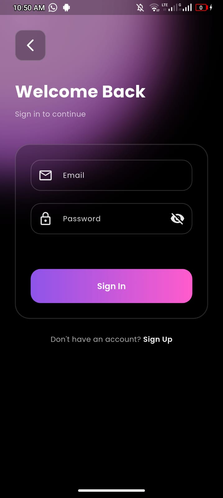
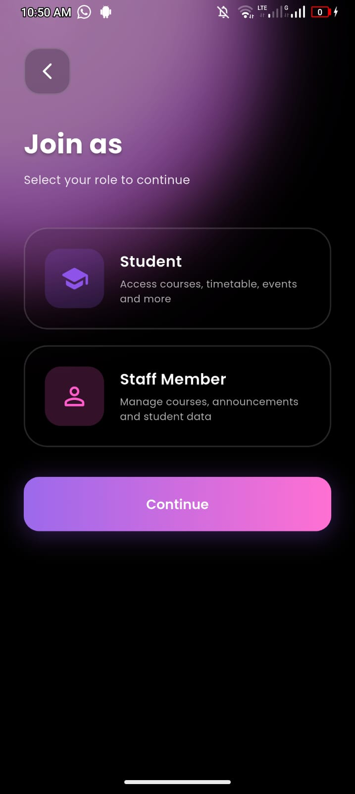
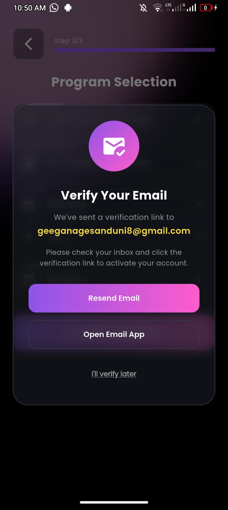
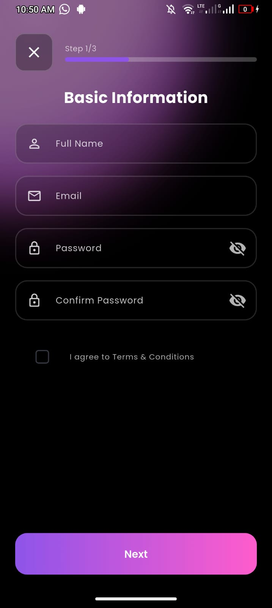
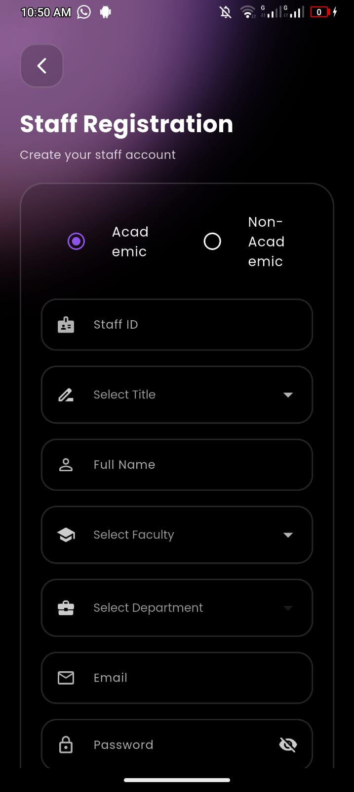

---

### 📊 Dashboards
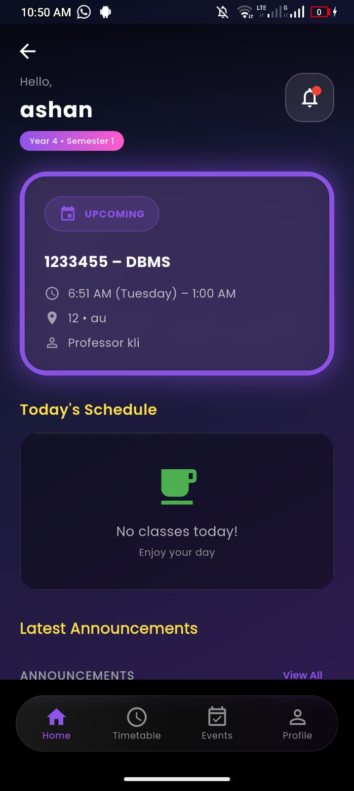
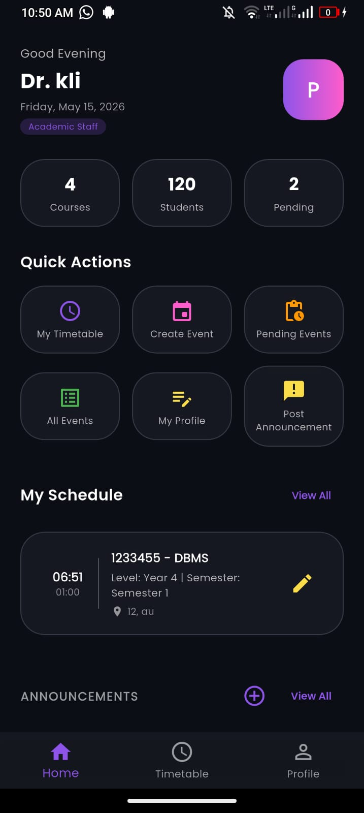
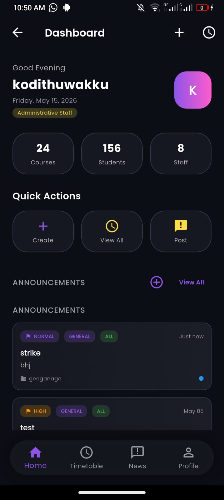

---

### 📅 Timetable

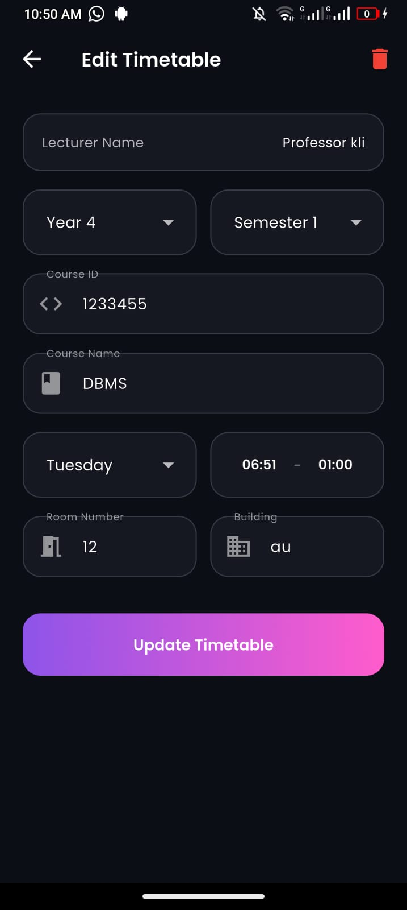

---

### 📢 Announcements
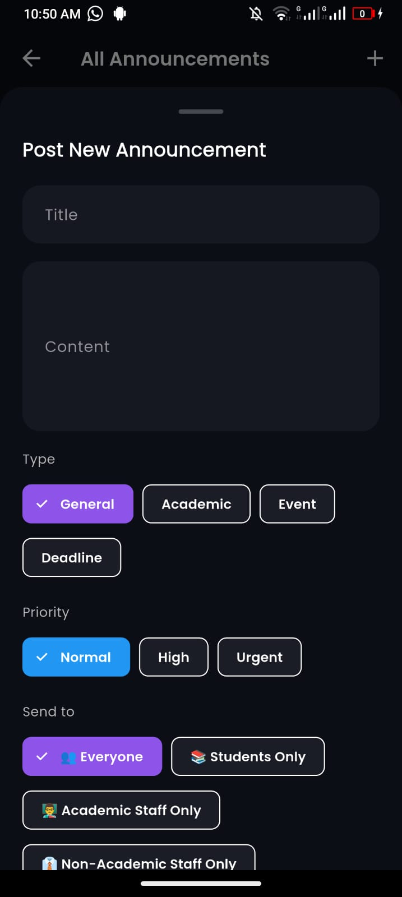
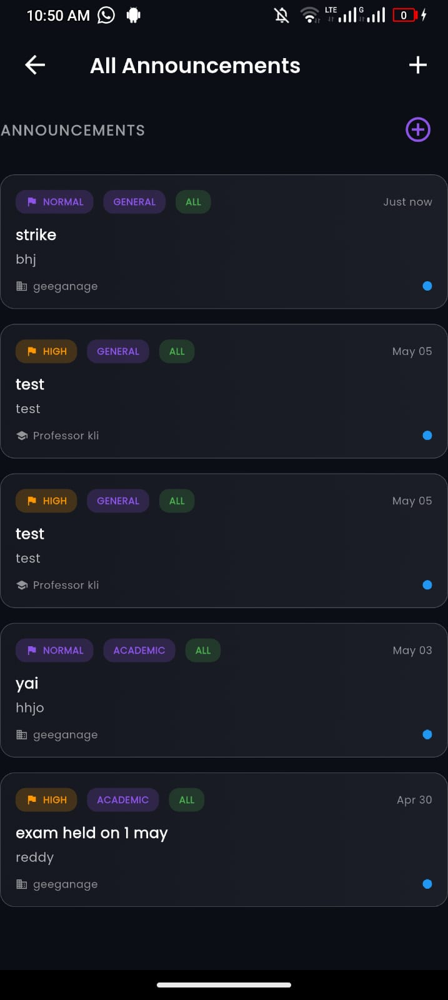

---

### 🗺️ Map & QR
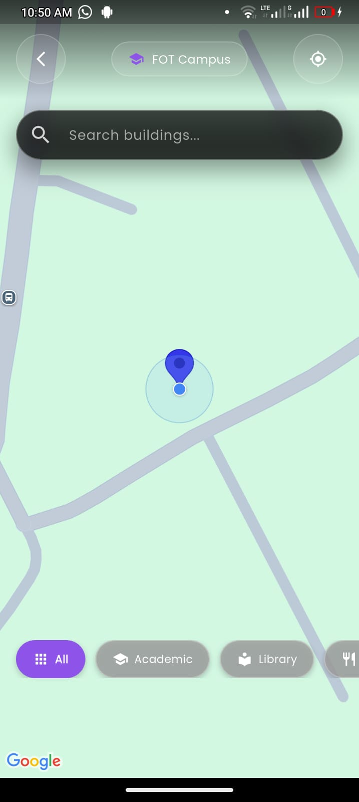


---

### 👤 Profile
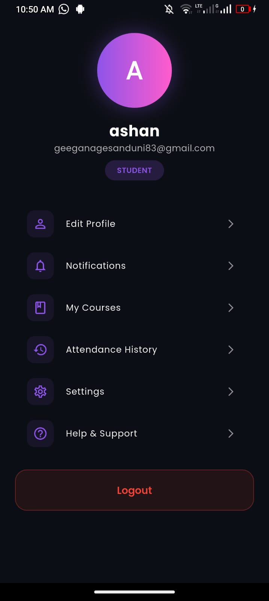

---

### 🚀 Splash Screen
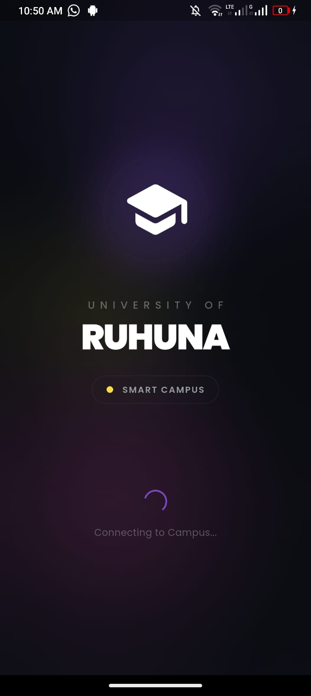

---

## 📂 Project Structure
lib/
├── screens/
├── widgets/
├── models/
├── services/
├── providers/

---

## 📦 Installation

```bash
git clone https://github.com/your-username/smart-campus-app.git
cd smart-campus-app
flutter pub get
flutter run
📌 Future Improvements
AI-based campus assistant
Offline mode support
Push notification system
Analytics dashboard
📄 License

This project is for academic purposes.

🙌 Acknowledgment

Developed for ICT4153 Mobile Application Development
Faculty of Technology, University of Ruhuna